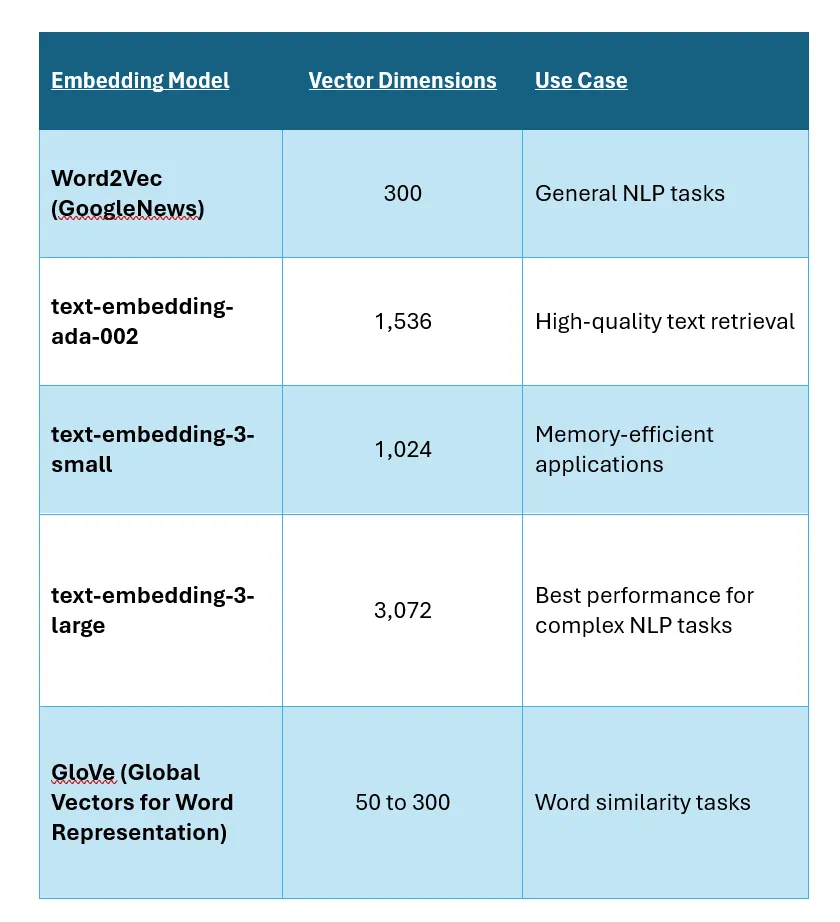

Embeddings are numerical vector representations of data such as text, images, audio, and video. They capture the semantic meaning of the data by mapping it into a high-dimensional vector space. These vectors are used in semantic search, an advanced information retrieval technique that understands the meaning and intent behind a query rather than relying solely on exact keyword matches. By comparing vector embeddings, systems can find conceptually related content even when different words are used.

[https://medium.com/the-generator/the-science-behind-embedding-models-how-vectors-dimensions-and-architecture-shape-ai-5b07c5cd7061]

2 Trade-offs in Choosing Dimensionality

    Lower Dimensions
    Pros: Faster computation, lower memory requirements.
    Cons: May lose fine-grained semantic distinctions.
    Higher Dimensions
    Pros: More detailed representation, better at capturing complex semantic relationships.
    Cons: Higher computational cost, larger storage requirements.
    Recent advancements allow models like OpenAI’s text-embedding-3 to dynamically adjust dimensionality (from 3,072 to lower dimensions like 256) to balance efficiency and accuracy.

